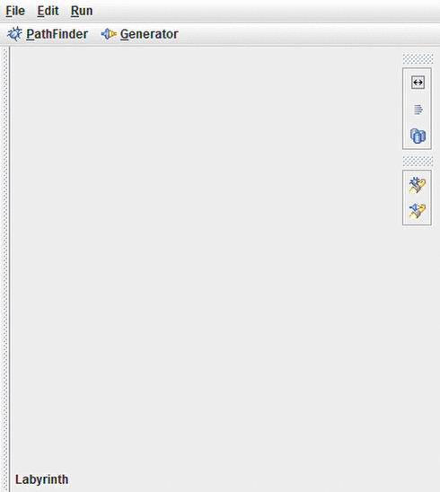

# labyrinth

<p align="center">
  
</p>

<p align="center">
  
  
</p>

<h1></h1>

Java (Swing, AWT) interactive and responsive Graphical User Interface (GUI) maze editor, generator and solver desktop application, implementing custom pathfinder and generator self-made generic algorithmic listener structure.

## Installation

1. Install [Red Hat Open JDK](https://developers.redhat.com/products/openjdk/download?sc_cid=701f2000000RWTnAAO)

2. Dowload **labyrinth.jar**

## Usage

Run **labyrinth.jar** from terminal (recommended) or double click it from the file explorer

```sh
java -jar labyrinth.jar
```

## Contributors

- **JoshGoA** - _Main contributor_ - [GitHub](https://github.com/JoshGoA)
